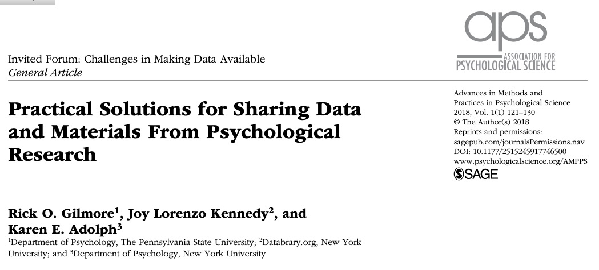
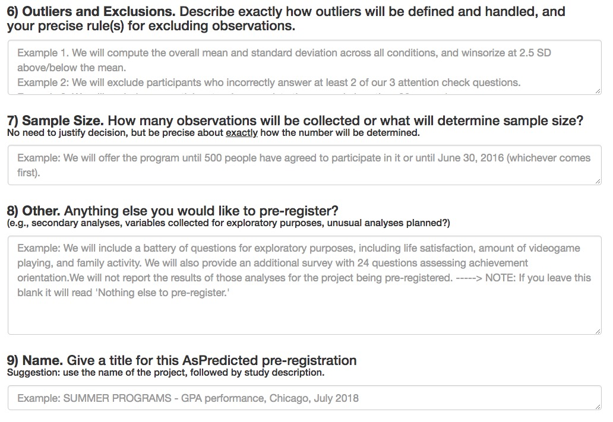

</br>


</br>


<!-- Funding sources with icons -->

## Agenda

- Some questions to ponder
- The "ethos" of science
- Issues, ideas, tools, & practices
- An open science future...

# Questions to ponder

---

<iframe width="560" height="315" src="https://www.youtube.com/embed/66oNv_DJuPc" frameborder="0" allow="accelerometer; autoplay; encrypted-media; gyroscope; picture-in-picture" allowfullscreen></iframe>

<https://www.youtube.com/embed/66oNv_DJuPc>

## What proportion of findings in the published scientific literature (in the fields you care about) are *actually true*?

---

- 100%
- 90%
- 70%
- 50%
- 30%

## How do we define what "*actually true*" means?

## Is there a reproducibility crisis in science?

---

>- Yes, a significant crisis
>- Yes, a slight crisis
>- No crisis
>- Don't know

---

<div class="centered">

</br>
<small>
([Baker, 2016](http://doi.org/10.1038/533452a))
</small>
</div>

<div class="notes">
Nature conducted a survey of some 1,600 scientists in 2016. They were asked this question and a few others. Here are the results.
</div>

## Have you failed to repoduce an experiment from your lab or someone else's?

---

<div class="centered">

</br>
<small>([Baker, 2016](http://doi.org/10.1038/533452a))</small>
</div>

<div class="notes">
</div>

## Does this surprise you? Why or why not?

---

<div class="centered">
<a href="http://www.nature.com/polopoly_fs/7.36719.1464174488!/image/reproducibility-graphic-online4.jpg_gen/derivatives/landscape_630/reproducibility-graphic-online4.jpg">

</a>

<small>[Baker 2016](http://doi.org/10.1038/533452a)</small>
</div>

<!-- Factors contributing to irreproducible research -->

---

<div class="centered">
<a href="http://www.nature.com/articles/s41562-016-0021/figures/1">

</a>

<small>[(Munafo et al. 2017)](http://doi.org/10.1038/s41562-016-0021)</small>
</div>

# The 'Ethos' of Science

## Robert Merton


---


---

>- **universalism**: scientific validity is independent of sociopolitical status/personal attributes of its participants
>- **communalism**: common ownership of scientific goods (intellectual property)
>- **disinterestedness**: scientific institutions benefit a common scientific enterprise, not specific individuals
>- **organized skepticism**: claims should be exposed to critical scrutiny before being accepted

## Some threats to these norms

>- Scientific validity depends on the status of its participants
>- Scientific goods/findings are not owned or shared with all
>- Scientific institutions benefit individuals, not society as a whole
>- Scientific claims are accepted or promoted without exposure to critical scrutiny

---


---

> "*...psychologists tend to treat other peoples’ theories like toothbrushes; no self-respecting individual wants to use anyone else’s.*"

<small>[Mischel, 2009](https://www.psychologicalscience.org/observer/becoming-a-cumulative-science)</small>

---

> "*The toothbrush culture undermines the building of a genuinely cumulative science, encouraging more parallel play and solo game playing, rather than building on each other’s directly relevant best work.*"

<small>[Mischel, 2009](https://www.psychologicalscience.org/observer/becoming-a-cumulative-science)</small>

# Issues, ideas, tools, & practices

---

- What is reproducibility?
- What is version control?
- Where/how to share data?
- Tools for reproducible workflows
- What's preregistration about?
- What are these big replication studies about?

# What is reproducibility?

## *Methods* reproducibility

- Enough details about materials & methods recorded (& reported)
- Same results with same materials & methods

<small>([Goodman et al., 2016](http://doi.org/10.1126/scitranslmed.aaf5027))</small>

<div class="notes">
Goodman et al. advocate a new lexicon for reproducibility where...
</div>

---

<div class="centered">

</div>
<div class="notes">
I like to call this the "hit by a truck" scenario.
</div>

## *Results* reproducibility
- Same results from independent study
<small>([Goodman et al., 2016](http://doi.org/10.1126/scitranslmed.aaf5027))</small>
<div class="notes">
Goodman et al. advocate a new lexicon for reproducibility where...
</div>

## *Inferential* reproducibility

- Same inferences from one or more studies or reanalyses

<small>([Goodman et al., 2016](http://doi.org/10.1126/scitranslmed.aaf5027))</small>
<div class="notes">
Goodman et al. advocate a new lexicon for reproducibility where...
</div>

# What is version control?

---


---

- thesis_new.docx
- thesis_new.new.docx
- thesis_new.new.final.docx

vs.

- thesis_2019-01-15v01.docx
- thesis_2019-01-15v02.docx
- thesis_2019-01-16v01.docx

## Version control systems

- Used in large-scale software engineering
- svn, bitbucket, git
- GitHub

## How I use GitHub

- Every project gets a repository
- Work locally, commit (save & increment version), push to GitHub
- Talks, classes, software, analyses, web sites

---


# Where/how to share data?

---

- Lab website vs.
- Supplemental information with journal article vs.
- Data repository
    - [Open Science Framework (OSF)](http://osf.io)
    - [ICPSR](https://www.icpsr.umich.edu/icpsrweb/)
    - [Databrary](http://databrary.org)
    - [OpenNeuro](http://openneuro.org)
    
---




# Reproducible workflows

---

- Data in interoperable formats (.txt or .csv)
- Scripted, automated = minimize human-dependent steps.
- Well-documented
- Kind to your future (forgetful) self
- Transparent to me & colleagues == transparent to others

---

```
# Import/gather data

# Clean data

# Visualize data

# Analyze data

# Report findings
```

---

```
# Import data
my_data <- read.csv("path/2/data_file.csv")

# Clean data
my_data$gender <- tolower(my_data$gender) # make lower case
...
```

---

```
# Import data
source("R/Import_data.R") # source() runs scripts, loads functions

# Clean data
source("R/Clean_data.R")

# Visualize data
source("R/Visualize_data.R")
...
```

# Tools for reproducible workflows

---

- Scripted analyses (SPSS, SAS, R, Python)
- [Jupyter notebooks](https://jupyter.org/)
- [Rmarkdown](https://rmarkdown.rstudio.com) via RStudio

## But my SPSS syntax file already does this
    
- Great! How are you sharing these files?
- (And how much would SPSS cost you if you had to buy it yourself?)

## But I prefer {Python, Julia, Ruby, Matlab, ...}

- Great! Let's talk about [R Markdown](https://rmarkdown.rstudio.com/)

## Reproducible research with [R Markdown](https://rmarkdown.rstudio.com/)

- Add-on package to R, developed by the RStudio team
- Combine text, code, images, video, equations into one document
- Render into PDF, MS Word, HTML (web page or site, slides, a blog, or even a book)

---

- [R Markdown documentation](https://rmarkdown.rstudio.com/); online [tutorial](http://r4ds.had.co.nz/r-markdown.html); Mike Frank and Chris Hartgerink's [tutorial](https://libscie.github.io/rmarkdown-workshop/handout.html)
- Similar to Mathematica notebooks, [Jupyter notebooks](http://jupyter.org)

---

```{r}
x <- rnorm(n = 100, mean = 0, sd = 1)
hist(x)
```
The mean is `r mean(x)`, the range is [`r min(x)`, `r max(x)`].

## Ways to use R Markdown

- Web [pages](http://gilmore-lab.github.io/) | [Rmd](https://raw.githubusercontent.com/gilmore-lab/gilmore-lab.github.io/master/index.Rmd)
- [Talks](gilmore-lab.github.io/DEVSEC-2018/promise-of-open-dev-sci/) | [Rmd](https://raw.githubusercontent.com/gilmore-lab/DEVSEC-2018/master/promise-of-open-dev-sci/index.Rmd)
- [Project notes](https://github.com/gilmore-lab/infant-moco-eeg/blob/master/plan-of-work.Rmd)
- Documentation: [HTML](https://gilmore-lab.github.io/databrary-reqmts-specs/databrary_1.0.html) | [Rmd](https://raw.githubusercontent.com/gilmore-lab/databrary-reqmts-specs/master/databrary_1.0.Rmd)

## Ways to use R Markdown

- Scriptable figures: [PDF](https://github.com/PLAY-behaviorome/site-demographics/blob/master/img/ed-attain-bars-plot-1.pdf) | [Rmd](https://raw.githubusercontent.com/PLAY-behaviorome/site-demographics/master/educational_attainment.Rmd)
- Scriptable timelines from Datavyu files: [Example](https://github.com/PLAY-behaviorome/video-coding/blob/master/img/NYU019/time-line-plot-00-60-1.png?raw=true) | [Rmd](https://raw.githubusercontent.com/PLAY-behaviorome/video-coding/master/timeline.Rmd) 
- Papers: [PDF](https://github.com/psu-psychology/r-bootcamp-2018/blob/master/talks/gilmore-hallquist-bootcamp-2018-papaja.pdf) | [Rmd](https://raw.githubusercontent.com/psu-psychology/r-bootcamp-2018/master/talks/gilmore-hallquist-bootcamp-2018-papaja.Rmd)

# What are registered reports and pre-registration about?

---


<https://cos.io/rr/>

---

# Why preregister?

- Nosek: "Don't fool yourself"
- Separate *confirmatory* from *exploratory* analyses
- Confirmatory (hypothesis-driven): *p*-hacking matters
- Exploratory: *p*-values hard(er) to interpret

## How/where

- OSF: <http://help.osf.io/m/registrations/l/524205-register-your-project>
- [AsPredicted.org](https://aspredicted.org/)

---


---


---



## Skeptics and converts

- Susan Goldin-Meadow (skeptic), ["Why pregistration makes me nervous"](https://www.psychologicalscience.org/observer/why-preregistration-makes-me-nervous)
- Mike Frank (former skeptic, now advocate), ["Pregister everything"](http://babieslearninglanguage.blogspot.com/2016/07/preregister-everything.html)

# What are these big replication studies about?

## Studies are underpowered {.smaller}

<div class="centered">


<small>[Szucs & Ioannides, 2017](http://doi.org/10.1371/journal.pbio.2000797)</small>
</div>

---

<div class="centered">
> "*Assuming a realistic range of prior probabilities for null hypotheses, false report probability is likely to exceed 50% for the whole literature.*"

[Szucs & Ioannides, 2017](http://doi.org/10.1371/journal.pbio.2000797)
</div>

## Many Labs


<small>[Klein et al. 2014](http://econtent.hogrefe.com/doi/abs/10.1027/1864-9335/a000178)</small>

---

## Reproducibility Project: Psychology (RPP)

> "*...The mean effect size (r) of the replication effects...was half the magnitude of the mean effect size of the original effects...*"

<small>[Open Science Collaboration, 2015](http://science.sciencemag.org/content/349/6251/aac4716)</small>

---

> "*...39% of effects were subjectively rated to have replicated the original result...*"

<small>[Open Science Collaboration, 2015](http://science.sciencemag.org/content/349/6251/aac4716)</small>

---


<small>[Camerer et al. 2018](https://www.nature.com/articles/s41562-018-0399-z)</small>

<!-- Figure from Camerer et al. 2018 -->

---


<small>[Camerer et al. 2018](https://www.nature.com/articles/s41562-018-0399-z)</small>

## If it's too good to be true, it probably isn't

<<https://80000hours.org/psychology-replication-quiz/>

# An open science future...

---

> "*The advancement of detailed and diverse knowledge about the development of the world’s children is essential for improving the health and well-being of humanity...*"

<small>SRCD Task Force on Scientific Integrity and Openness</small>

---

> "*We regard scientific integrity, transparency, and openness as essential for the conduct of research and its application to practice and policy...*"

<small>SRCD Task Force on Scientific Integrity and Openness</small>

---

>"*...the principles of human subject research require an analysis of both risks and benefits...such an analysis suggests that researchers may have a positive duty to share data in order to maximize the contribution that individual participants have made.*"

<small>[Brakewood & Poldack, 2013](http://dx.doi.org/10.1016/j.neuroimage.2013.02.040)</small>

---

<div class="centered">

</div>

<!-- We don't have to be like the blind men and the elephant -->

---

<div class="centered">

</div>


---

<video width="800" loop data-autoplay>
  <source src="https://github.com/gilmore-lab/DEVSEC-2018/blob/master/mov/databrary-splash.mp4?raw=true" type="video/mp4">
  </video>

rogilmore@psu.edu

<https://gilmore-lab.github.io>

<https://gilmore-lab.github.io/2019-01-15-open-science-psu-hhd/>

---

## Stack

This talk was produced on `r Sys.Date()` in [RStudio](http://rstudio.com) version using R Markdown and the reveal.JS framework.
The code and materials used to generate the slides may be found at <https://github.com/gilmore-lab/2019-01-15-open-seicne-psu-hhd/>.
Information about the R Session that produced the code is as follows:

```{r session-info}
sessionInfo()
```

